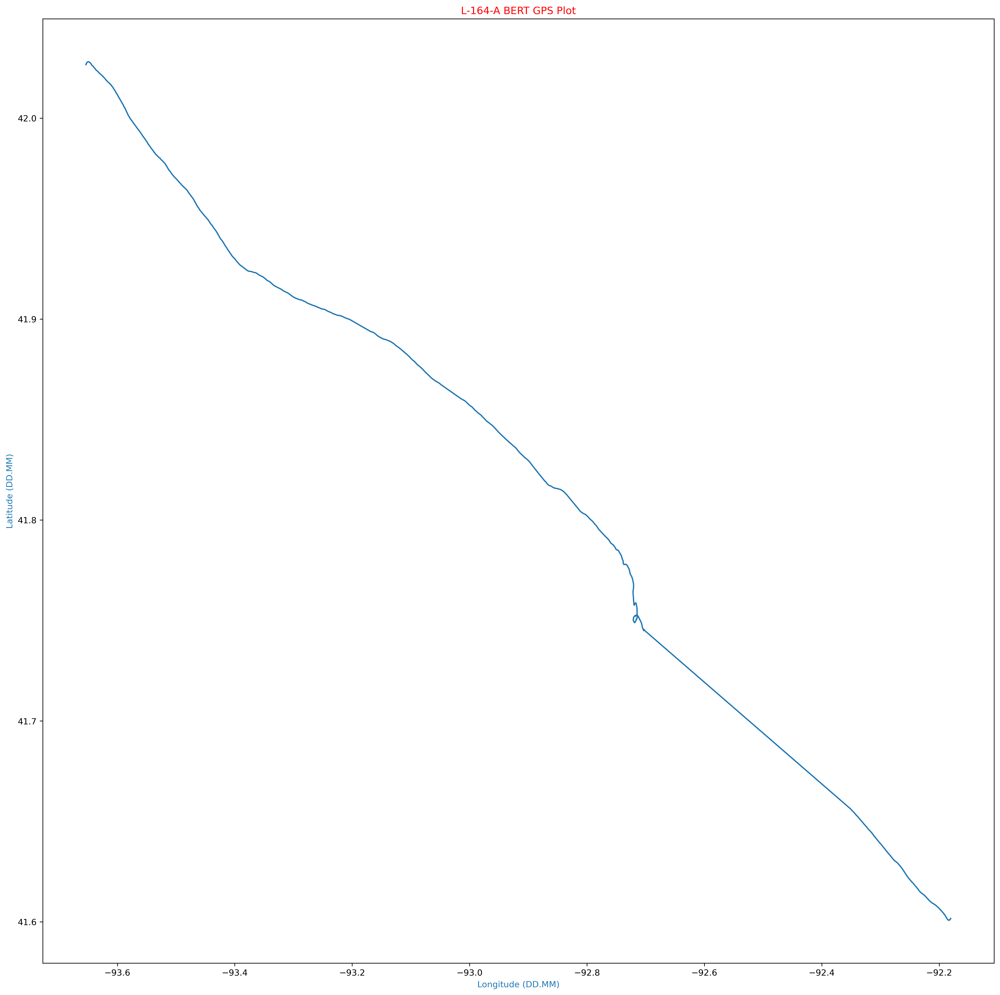

# Mission-164
Mission 164 Flights

## Mission
HABET Mission 164 is assigned to support the flights for the 2022 Academic High Altitude Conference (AHAC). The conference was held at Iowa State University on September 28th and 29th.

## Flight information
### HABET Flight L-164-A
Launched September 29th at approximately 0915 from Howe Hall on the campus of Iowa State University

### Spacecraft
The HABET team only provided launch services and used their Backup Emergency Recovery Transmitter (BERT). Other spacecrafts were provided by the University of Minnesota and St. Catherine's University. 

### Payloads
Coming soon

# Data Collected

## BERT Data
An anomaly caused BERT to malfunction during the flight. This prevented BERT from transmitting its data via the SatComm link. However, it appears that BERT did record data during most of the flight. There was a gap in the data collected that appears to have happened shortly after the burst. It should also be noted that the burst happened much sooner than predicted.

### Atmospheric Data
Below is the temperature data recorded. This was recorded with the onboard temperature since located on the Clue board. This board was located in a plastic case with a clear window on it. This would not accurately represent atmospheric temperature.

  Below is the Humidity Data recorded

  

Below is the Pressure Sensor data recorded. This was in a case that was somewhat sealed.
  

Temperature data compared to the altitude as recorded by the GPS.

  

Temperature and Humidity Plot

### GPS Data

The following graphs are generated from the onboard GPS Unit. This includes Lat/Lon and Altitude data. We also plot this on a map using Tilemaps in Python.

We have confirmed that we have valid GPS data, so we can overlay this information using Tilemaps and Open Street Maps.

The following is now zooming into the landing spot on the map
  

### IMU Data
The following plots are data from the 9-DOF IMU that is on the Adafruit Clue Board.

 

   

   

# Wrap up
Additional plots can be found in the Plots directory. You can find a KML file in the KML directory. Finally, the raw CSV file can be found in the Data folder.